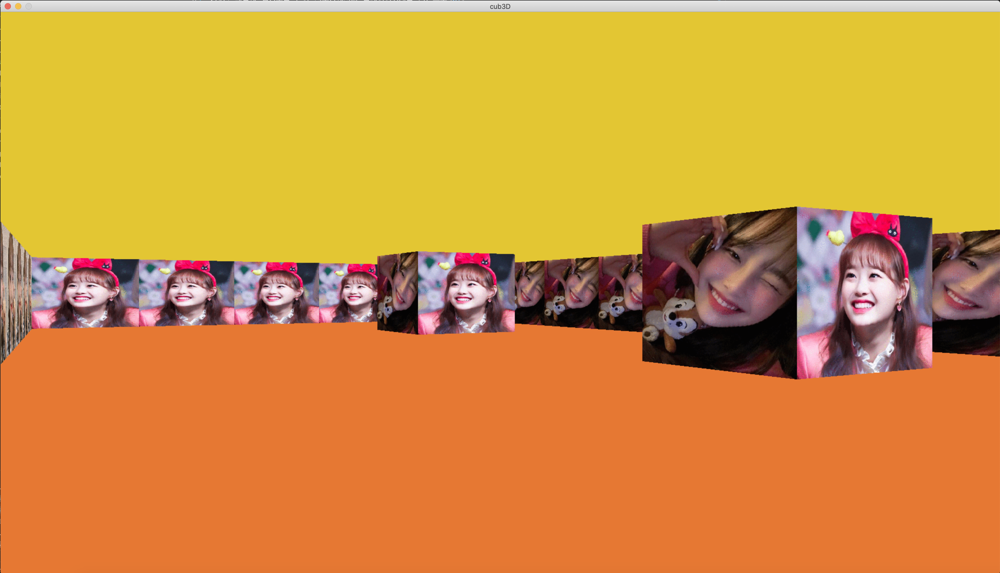

# cub3d ; 3d Graphics Game
## 42Seoul Project

<br>
<br>
## 레이캐스팅을 이용한 3D 그래픽 게임 구현<br><br>
### <레이캐스팅 간단설명>
2차원 배열에 맵정보를 받아 지도상에서의 플레이어위치를 기반으로<br>
플레이어의 시야상에서 볼 수 있는 벽들과 플레이어 사이의 거리를 <br>
벡터연산하여 화면에 출력할 벽의 높이를 계산. <br>
<br>
플레이어가 점프를 하지 않으므로 화면상에 벽의 세로길이만 맞춰준다면 3d로 보이게 된다.<br>
화면의 가로길이가 640이라면 640개의 벽높이를 계산하여 렌더링한다.<br>
<br>
>  Library Manual : https://harm-smits.github.io/42docs/libs/minilibx/introduction.html<br>
> Raycasting Manual : https://harm-smits.github.io/42docs/projects/cub3d

<br><br>

### <사용법>
```
make
./cub3d <map file> (ex: ./cub3d 4.cub)
```

> W, A, S, D로 이동 <br>
방향키 <-, -> 로 좌우 회전 <br>

<br>

### <map 설정>
밑에 있는 인자들이 모두 정상적으로 표기되어야 실행가능.<br>
지도상에서 플레이어가 공백으로 빠져나가면 에러. -- 코드상에서 bfs로 확인 <br>

```
NO textures/chuu_no.xpm
SO textures/chuu_so.xpm
WE textures/chuu_we.xpm
EA textures/chuu_ea.xpm		// 게임내에서 동, 서, 남, 북 방향에 띄울 이미지파일 경로

F 51,120,230		// 바닥 배경 RGB Color
C 51,198,227		// 천장 배경 RGB Color

1111				// 1:벽 0:빈공간
11					// 플레이어위치 표기 : [N, S, E, W] 시작시 바라보게 되는 시야 지정.
1111

111111111111
100000000001
100100010001
100000000001
10000000N001
100000000001
111111111111

1111
1001
1111
```